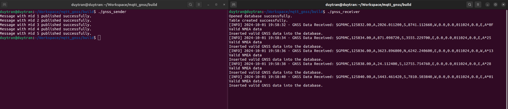

<h1>
  
  <p align="center">MQTT publisher/subscriber GNSS data</p>
</h1>

## Table of Contents
- [Table of Contents](#table-of-contents)
- [Architectural Design](#architectural-design)
- [Getting Started](#getting-started)
  - [Library Installation](#library-installation)
  - [Cloning the Project](#cloning-the-project)
- [Building and Running](#building-and-running)
  - [Setting up Makefile](#setting-up-makefile)
  - [Building](#building)
  - [Running Tests](#running-tests)
- [Contributing](#contributing)

## Architectural Design
The system demonstrates a simplified telematics solution where GNSS data is transmitted between a sender and receiver using MQTT. It mimics how a vehicle (represented by the GNSS sender) communicates its position to a server (GNSS receiver). The design focuses on demonstrating core data transmission concepts in a controlled, software-based environment. 
- GNSS Sender: The sender module retrieves GNSS data from a simulated GNSS module in a vehicle, converts it into NMEA sentences, and publishes the data to a designated MQTT broker.
- GNSS Receiver: The receiver subscribes to the GNSS data published by the sender, processes it, and stores valid data into an SQLite database for further analysis or reporting.

**Please note that this is only a demo and does not involve any real-world hardware components.**

<h1>
  
</h1>

To understand the high-level design, please take a look at the component diagrams for GNSS_Sender and GNSS_Receiver located in **docs/component_diagram/**. These diagrams illustrate the interaction between components, communication flows, and the structure of the system.

## Getting Started
To get a local copy up and running, follow these steps.

### Library Installation
**mosquitto** and **sqlite3** must be installed on your Linux system. You can install them with the following commands:

```bash
sudo apt install libmosquitto-dev libsqlite3-dev
```

### Cloning the Project
Clone the repository using Git:

```bash
git clone https://github.com/tmduy/mqtt_gnss.git
cd your-repository/mqtt_gnss
```

## Building and Running
### Setting up Makefile
**Makefile** is already provided and can be edited if needed.
Ensure you have g++ and necessary build tools installed.

### Building
Run make to build the project:
```bash
make
```
After **make**, executable files located in **build/**.

### Running Tests
Start by running **gnss_receiver** to initialize the DBMS and listen for messages from the sender:
```bash
cd build
./gnss_receiver
```
After that, we execute **gnss_sender**:
```bash
./gnss_sender
```

Test results will be displayed:
<h1>
  
</h1>

- After the gnss_sender sends 5 messages, it will complete execution and automatically exit.
- At the gnss_receiver side, it will be still in the while loop. If you want to exit the program, you can press **Ctrl+C** to send the terminate signal (For more detail, please take a look at the source code).
**Note: Ensure that both gnss_sender and gnss_receiver are running in separate terminal windows or tabs for correct communication.**

## Contributing
I welcome contributions to improve this project! To contribute:

1. Fork the repository.
2. Create a new branch (git checkout -b feature-branch).
3. Make your changes.
4. Commit your changes (git commit -am 'Add new feature').
5. Push to the branch (git push origin feature-branch).
6. Create a new Pull Request.
7. For major changes, please open an issue first to discuss the proposed changes.
